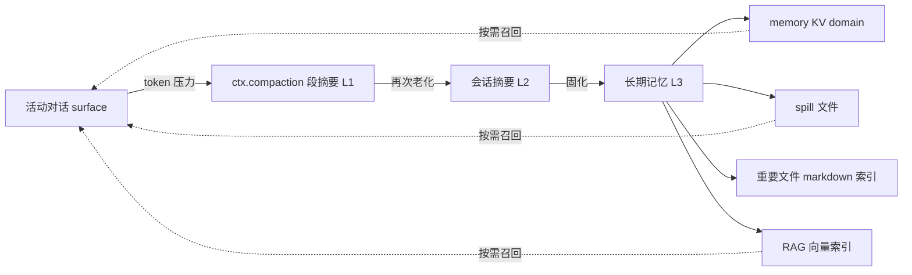

# DSH Desktop 上下文管理改造 · 设计方案（提案）

> 状态：**提案（proposed）**，尚未实现。本文定义「对话过长自动压缩 + 分层压缩 + 长短期记忆」核心闭环的架构，以及 KV 缓存、重要文件 markdown、RAG、上下文缓存与 30 天回收箱的配套落点。核心约束：`deepseek-harness/` 是只读上游子模块，本次改造全部落在 Desktop 自有插件层，通过已文档化的扩展点组合/替换上游服务，不改动上游任何源码。

## 一、背景与目标

DSH Desktop 围绕只读的 `deepseek-harness` 子模块构建。上游已具备成熟的**单层**上下文管理：`compaction-basic` 在 token 压力下把最旧历史摘要为一段文本，`spill` 把超大文本溢出到私有文件，`storage-domain` 提供 schema 校验的 KV 持久化，`session-projection-cache` 提供会话投影的持久缓存。

本次改造把「单层摘要」升级为「多层金字塔」，并引入长期/短期记忆边界，使长时间、跨重启的协作不再只依赖一段不断被重写的摘要。目标分三层：

1. **对话过长自动压缩**：复用上游 `compaction-basic` 的触发与阈值，作为金字塔最底层的降级入口。
2. **分层压缩架构**：摘要随年龄逐级再摘要（段 → 会话 → 长期），每一级摘要是下一级的输入。
3. **长期/短期记忆**：短期记忆=仍在上下文内的 L0/L1/L2；长期记忆=退出上下文的持久层（KV + spill 文件 + markdown 索引 + 可选 RAG），按需召回。

KV 缓存、重要文件 markdown、RAG、上下文缓存与 30 天回收箱是围绕同一架构的配套能力，分阶段落地。

## 二、现状盘点（上游已有，复用不重造）

| 能力 | 上游包 | 服务 / 机制 |
|---|---|---|
| 对话过长自动压缩 | `compaction-basic` | `ctx.compaction`：`thresholdRatio`/`retainRatio` 阈值、`context-overflow` 恢复、`/compact` |
| 工具结果溢出到文件 | `spill` + `spill-local` | `ctx.spillStore`：私有 session 文件 + 定位符 + 检索提示 |
| 30 天清理（硬删除） | `spill-local` | `cleanupPeriodDays: 30`，启动一次性清扫，直接删除过期文件 |
| KV 持久化 | `storage-domain` + `storage-json`/`storage-sqlite` | `ctx.storageDomain`：schema 校验 KV domain + `domain/changed` 事件 |
| 持久投影缓存 | `session-projection-cache` | 会话投影 checkpoint，冷启动零 IO 读取列表值 |
| 有界输出 | `output-retention` | `ItemRetainer`/`TextRetainer`，统一省略脚注 |
| 请求上下文 | `context` 族 | `agent-instructions`（AGENTS.md）、`file-reference`（@file）、`session-reference` |

这些是可直接复用的成熟能力。改造的核心不是重写它们，而是在其上建立**层级关系**和**持久化边界**。

## 三、需求映射

| 用户需求 | 上游现状 | 本次策略 |
|---|---|---|
| kv 缓存 | 已有 `storage-domain` | 复用，新增 `memory` KV domain |
| 重要文件 markdown | 无 | 新建：把重要文件索引为 markdown 条目 |
| RAG | 无 | 新建：可选向量检索插件（阶段三） |
| 3kda+1gated mla | 模型/注意力架构规格 | 作为摘要模型路由配置项 + 暖前缀 KV 缓存复用策略 |
| 对话过长自动压缩 | 已有 `compaction-basic` | 复用，作为分层压缩最底层触发 |
| 上下文缓存 + 30 天回收箱 | 部分（投影缓存 + spill 硬删除） | 复用系统回收站，替换桌面自有文件硬删除 |
| 分层压缩架构 | 无 | 新建：多级摘要金字塔 |
| 长短期记忆 | 无 | 新建：组合摘要 + KV + spill + RAG |

## 四、总体架构

### 4.1 分层压缩模型

把上游的「单层摘要」扩展为四级金字塔：

- **L0 短期（原文）**：上下文内保留的最近消息——即上游 compaction 的 retained tail 加当前活动 surface。
- **L1 段摘要**：L0 老化后，最旧的平衡区间被 `ctx.compaction` 压缩为段摘要，仍留在上下文内。
- **L2 会话摘要**：多个 L1 段摘要再被摘要为会话级摘要（「摘要的摘要」）。
- **L3 长期记忆**：L2 摘要 + 关键事实/文件索引固化到持久层，退出上下文，按需经检索召回。

关键不变量：

- 每级摘要是下一级的输入，摘要可被再次摘要（recursive summarization）。
- L3 与上下文解耦：模型通过检索接口按需读取，而不是常驻上下文。
- 每一级都保留「原文定位符」（spill locator）兜底，避免摘要信息损失后原文不可达。

### 4.2 长期/短期记忆边界

- **短期记忆** = L0 + L1 + L2 中仍在上下文内的部分，由 `ctx.compaction` + `ctx.tokenMeter` 的阈值决定何时降级。
- **长期记忆** = L3 持久层：
  - `memory` KV domain：结构化事实、偏好、摘要（带 sessionId + seq 区间 + 时间戳）。
  - spill 文件：大块原文。
  - markdown 索引：被标记为「重要」的文件条目。
  - RAG 向量索引（可选）：语义检索。
- 转换路径：L2 → L3 时，摘要写入 KV domain 并打时间戳；召回时按相关性/时间排序，作为一条 `user/message` 注入上下文（复用上游 `session-reference` 的「以 user 角色进入历史」模式）。

### 4.3 数据流

## 五、关键设计决策

### 5.1 分层压缩（新）

- 新增 Desktop 插件 `desktop-context`，监听 `agent/pre-step`（与 `compaction-basic` 相同的钩子），在 compaction 阈值之后执行分层降级。
- 复用 `ctx.compaction` 完成 L0→L1；L1→L2 用同一接口对「段摘要消息集合」再摘要。
- 统一用 `ctx.tokenMeter` 计价，避免多套估算口径；每级阈值暴露为 `Config` 字段（不硬编码）。

### 5.2 长期记忆（新）

- 用 `defineDomain` 声明 `memory` domain，表：`summaries`（按 sessionId + seq 区间）、`facts`、`preferences`、`files`。
- 摘要固化写入 `ctx.storageDomain` 的 `memory` domain，天然获得 schema 校验 + 持久化 + `domain/changed` 事件。
- 新增服务 `ctx.desktopMemory`：`remember()` / `recall()`，封装 L3 的写入与召回。

### 5.3 KV 缓存（复用）

- 直接复用 `storage-domain`。Desktop 已依赖 `@deepseek-ai/dsh-storage-domain`，无需新造 KV。
- 后端选 `storage-json`（人类可读）或 `storage-sqlite`（频繁点更新），由 `storage-domain` 的 `backend`/`routes` 配置决定。

### 5.4 重要文件 markdown（新）

- 新增「重要文件」索引：当模型/用户把某文件标记为重要，将其路径 + 摘要 + 关键内容转为一条 markdown 记录，写入 `memory` domain 的 `files` 表；内容大时正文走 spill，markdown 只存元数据 + locator。
- 作为 RAG 与长期记忆的种子语料。

### 5.5 RAG（新，阶段三）

- 可选插件：本地 embedding + 向量库（或复用 `storage-sqlite` 承载向量表）。
- 检索接口注入 `ctx`，模型通过工具/引用按需召回 L3 记忆。
- 与上游 `session-reference` 区分：RAG 做语义检索，session-reference 做确定性快照引用，两者并存。

### 5.6 30 天回收箱（复用系统回收站，新）

- 现状：桌面自有文件产物（诊断日志、更新安装包）在轮转/清理时是**硬删除**（`unlinkSync`/`unlink`）；上游 `spill-local` 的 30 天清理也是硬删除，但无拦截钩子、且 spill 文件生命周期由上游决定，不属于桌面可安全改动的范围。
- 改造：**复用系统回收站**（Electron `shell.trashItem`）替换桌面自有文件产物的硬删除——「移入系统回收站」而非「直接删除」，用户可在系统回收站中手动找回。桌面已现成接线：`desktop-factory-reset` 通过注入的 `trashItem`（绑定 `shell.trashItem`）把数据移入系统回收站，含 fail-closed 安全边界。
- 落地对象（桌面自有、可恢复、不涉及上游）：
  - 诊断日志**年龄轮转**：`log-files.ts` 的 `purgeOlderThan(7)`（`LogFileSinkOptions.trashItem` 注入，回收站失败回退 `unlinkSync`）。
  - 更新安装包清理：`update-download.ts` 的 `resolveDesktopUpdateArtifact(remove)` 新增 `trashItem` 参数，删除时移入回收站。
- 明确不覆盖：spill 文件（上游硬删、无钩子）、投影缓存（上游持有）、L3 摘要/RAG 索引（KV 记录，非文件，`shell.trashItem` 不适用）；日志的**容量阀** `enforceDirectoryCap()`（`write()` 内联同步路径，保持同步硬删除的安全阀语义）与**全量清空** `clear()`（显式清空意图，保持硬删除）。
- 开关与限制：`trashItem` 通过注入提供；开关为**机器级**环境变量 `DSH_DESKTOP_RECYCLE_BIN`（默认关，非空且非 `0`/`false` 时开启，见 `desktop-recycle-bin.ts`）——主进程日志清理发生在 Profile 选择前，故不用 per-Profile 偏好。**host 进程**（`host-process-entry.ts`，独立 Node utility 进程、无 Electron main API）的日志 sink 无法使用 `shell.trashItem`，本轮不覆盖，后续可经 RPC 让 supervisor 代为回收。

### 5.7 3kda+1gated mla（模型/注意力架构规格）

- 作为**摘要/压缩模型选型**落地：`desktop-context` 配置暴露 `summarizationProvider`/`summarizationModel`（透传上游 `compaction-basic` 已有字段），指向具备该注意力架构的模型。
- 架构层面的影响体现在 **KV/前缀缓存**：MLA 的潜在 KV 压缩使「暖前缀复用」收益更大。上游 `compaction-basic` 已按「重放 system prompt + 被遮蔽消息作为真实前缀，仅尾随指令与摘要输出不命中缓存」最小化 KV 重算；分层压缩的 L2/L3 摘要调用沿用同一策略。

> 说明：本项对「3kda+1gated mla」的理解为「摘要/压缩模型的注意力架构规格」，落地为配置项与暖前缀复用策略。若其指代具体的模型名称或层配置，需在实现前补充明确值。

## 六、落地方式（Desktop 自有插件）

- 位置：`dsh-plugin-desktop-beta/` 新增子路径 `desktop-context`（`src/context/…`），经 `cordis.patch.yml` 注入（`id: desktop-context`）。
- 服务组合：
  - 复用：`ctx.compaction`（L0→L1）、`ctx.storageDomain`（KV）、`ctx.spillStore`（大块原文）、`ctx.tokenMeter`（计价）、`ctx.sessionProjections`（冷启动）。
  - 新增：`ctx.desktopMemory`（长期记忆）、`ctx.desktopContextTrash`（回收箱）、可选 `ctx.desktopRag`（向量检索）。
- 不修改上游：所有新增行为挂在已文档化的扩展点（`agent/pre-step`、`domain/changed` 等）上。

## 七、分阶段实施

- **Phase 1（核心闭环）**：`desktop-context` 插件骨架 + 分层压缩（L0→L1 复用 compaction，L1→L2 再摘要）+ 长期记忆落库（`memory` domain）+ 短期/长期边界。
- **Phase 2**：30 天回收箱（桌面自有文件硬删除 → 移入系统回收站）。
- **Phase 3**：重要文件 markdown 索引 + RAG 向量检索（可选插件）。

## 八、风险与边界

- 上游只读：所有能力挂在扩展点，`deepseek-harness/` 内代码零改动。
- 分层压缩的摘要质量依赖摘要模型；L2/L3 的「摘要再摘要」有信息损失，靠 spill locator 保留原文兜底。
- RAG 依赖 embedding 提供方；作为可选插件，缺失时不阻断核心闭环。
- 回收箱的保留期沿用桌面现有日志轮转配置（`purgeOlderThan(7)` / 目录容量上限），回收站本身由操作系统管理；回收箱能力由机器级环境变量 `DSH_DESKTOP_RECYCLE_BIN` 开关、默认关，不硬编码（符合上游「无硬编码可调项」约定）。

## 九、验收标准

- 长对话越过阈值后自动分层压缩，L0→L1→L2 逐级降级且上下文内 token 保持有界。
- 会话重启后 L3 记忆可经检索召回。
- 桌面自有文件产物在轮转/清理时进入系统回收站而非直接删除，可恢复（年龄轮转日志 + 更新安装包）。
- 上游 `deepseek-harness/` 无改动；`corepack yarn check`（typecheck + test）通过。
