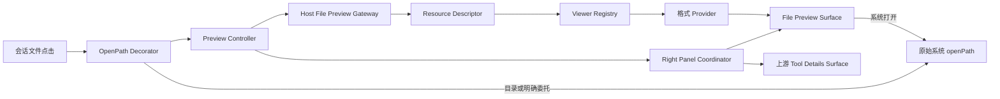

# DSH Desktop 内置文件查看器设计

Status: implemented

本文档描述 DSH Desktop 面向程序员常用文件格式的内置只读查看器。目标是在用户点击会话中的文件链接时，将文件直接显示在当前会话右侧，同时保留“使用系统默认应用打开”的显式操作。

## 1. 背景

当前文件点击链路为：

```text
会话中的文件链接
  -> ui-conversation.openFile(path)
  -> workspaces.openPath(path)
  -> WorkspaceRuntime.openPath(path)
  -> Host host.openPath(path)
  -> 操作系统默认应用
```

因此，用户查看 Agent 新建或修改的源码时会离开 DSH Desktop。ChatGPT 和 Claude Desktop 的同类体验是在会话旁保留一个文件或 artifact 面板，用户可以一边阅读代码，一边继续查看和发送消息。

DSH Desktop 已在高级模式中拥有 `AdvancedFrame`。该 Frame 包含 sidebar、conversation、details 三列，其中右侧 details 当前用于上游会话工具详情。文件查看器应复用 Desktop 已拥有的第三列几何，而不能修改 pinned 上游 checkout，也不能与上游 `details` 单占用 Slot 争抢所有权。

兼容模式必须继续运行未经覆盖的上游客户端，不注册文件拦截、查看器 UI、样式或额外读取能力。

## 2. 目标与非目标

### 2.1 目标

- 点击受支持的普通文件后，在当前会话右侧打开只读查看器。
- 主要覆盖程序员日常使用的源码、配置、文本、Markdown、JSON 和开发资源图片。
- 保留“使用系统默认应用打开”，用户可以随时退出内置查看路径。
- 采用 Provider 结构隔离第 4 节内各类渲染，面板控制器不包含格式分支。
- 保留上游 tool details 状态，文件预览和工具详情之间可以切换。
- 所有文件处理均在本机完成，不使用第三方预览服务。
- 文件读取、请求、资源令牌、注册项和 UI effect 都有明确的生命周期与释放路径。

### 2.2 非目标

- 不提供文件编辑、保存、自动格式化或 IDE 功能。
- 不为第 4 节支持范围以外的文件提供内置渲染。
- 不构建多标签编辑器、目录树或完整 IDE。
- 不向 renderer 暴露 Node、Electron IPC、原始 `file://` 或不受限文件系统能力。
- 不修改 `deepseek-harness/` pinned 上游子模块。

## 3. GitHub 调研

调研数据记录于 2026-08-16。

| 候选 | 许可与状态 | 适用性结论 |
| --- | --- | --- |
| [open-file-viewer](https://github.com/xushanpei/open-file-viewer) | MIT；约 1.3k stars；`0.1.40`；2026-08-14 仍有发布 | 架构最接近，采用 core、React adapter 和格式 plugin。但当前 [`@open-file-viewer/core`](https://www.npmjs.com/package/@open-file-viewer/core) 是约 6 MB 的单一发布入口，依赖范围远超本方案，且没有按格式提供 subpath export。项目创建时间短、单维护者。适合借鉴 Provider 思路，不适合整体进入 DSH 核心依赖。 |
| [Monaco Editor](https://github.com/microsoft/monaco-editor) | MIT；持续维护 | worker、语言服务和数 MB bundle 更适合完整 IDE，对本方案的只读源码查看过重，不采用。 |
| [CodeMirror 6](https://github.com/codemirror/dev) | MIT；模块化、持续维护 | 只读能力完整，但仍需引入新的编辑器运行时和语言包；本方案复用 DSH 已有源码渲染能力，不采用。 |
| [Shiki](https://github.com/shikijs/shiki) | MIT；持续维护 | 适合静态只读源码高亮，并且 DSH 已通过 UI primitives 集成，确定作为源码渲染基础。 |
| [QwenPaw](https://github.com/agentscope-ai/QwenPaw) | Apache-2.0 | 可参考 coding tab、本地文件处理和代码视图布局，不直接复用其编辑器实现。 |
| [Hermes Agent](https://github.com/NousResearch/hermes-agent) | MIT | 可参考聊天右栏 artifact 的打开、关闭和会话关联交互，不作为查看器依赖。 |
| [Open WebUI](https://github.com/open-webui/open-webui) | BSD-3-Clause | 其代码与 Markdown 呈现也采用聚焦的语法高亮组件，支持复用现有渲染基础而非引入完整编辑器的决策。 |

Provider 排名与 MIME 选择借鉴 [JupyterLab RenderMimeRegistry](https://jupyterlab.readthedocs.io/en/4.1.x/api/classes/rendermime.RenderMimeRegistry-1.html)，格式扩展边界借鉴 VS Code `CustomEditorProvider`。结论是构建 DSH 自有的轻量面板和权限边界，复用现有 Shiki、Markdown 和 JSON UI primitives，不整体集成通用查看器。

## 4. 支持格式

| 类别 | 格式 |
| --- | --- |
| JavaScript/Web | `.js`、`.jsx`、`.ts`、`.tsx`、`.mjs`、`.cjs`、`.html`、`.css`、`.scss`、`.less`、`.vue`、`.svelte` |
| 通用语言 | `.py`、`.go`、`.rs`、`.java`、`.kt`、`.c`、`.h`、`.cc`、`.cpp`、`.hpp`、`.cs`、`.php`、`.rb`、`.lua`、`.swift` |
| Shell/自动化 | `.sh`、`.bash`、`.zsh`、`.ps1`、Dockerfile、Makefile |
| 配置与数据 | `.json`、`.jsonc`、`.yaml`、`.yml`、`.toml`、`.xml`、`.ini`、`.conf`、`.env`、`.properties`、`.sql`、`.graphql`、`.proto` |
| 文本与文档 | `.md`、`.mdx`、`.txt`、`.log`、无扩展名但可可靠解码为 UTF-8 的文本 |
| 变更文件 | `.diff`、`.patch`，使用 Source Provider 查看 |
| 开发资源 | `.png`、`.jpg`、`.jpeg`、`.gif`、`.webp`、`.svg` |

## 5. 总体架构



### 5.1 设计模式

| 模式 | 应用位置 | 目的 |
| --- | --- | --- |
| Decorator | `workspaces.openPath()` 包装器 | 不修改上游调用方；保留原方法；plugin dispose 时可精确恢复。 |
| Gateway | Host 文件预览入口 | 集中处理路径授权、文件类型、读取上限、令牌和错误折叠。 |
| State Machine | Preview Controller | 管理 `closed`、`loading`、`ready`、`error`，以及取消和刷新。 |
| Registry + Strategy | Viewer Registry 和 Provider | 第 4 节内每类格式独立注册策略，不修改面板主流程。 |
| Chain of Responsibility | Provider 选择 | 多个 Provider 匹配时按优先级选择最具体实现。 |
| Mediator | Right Panel Coordinator | 协调 file preview、tool details、session 和 layout。 |
| Adapter | Shiki 与浏览器图片能力 | 渲染实现不直接污染 Controller 与协议。 |

## 6. 主要组件

### 6.1 OpenPath Decorator

只在 Desktop 高级模式安装，包装现有 `workspaces.openPath(path)`：

1. 保存原始方法和原始 property descriptor。
2. 将普通文件交给 Preview Controller。
3. 目录、非 regular file、Host 拒绝预览的路径继续调用原始方法。
4. 面板中的“系统打开”始终调用保存的原始方法，避免递归。
5. dispose 时仅当当前方法仍是自己的 wrapper，才恢复原始 descriptor，避免覆盖其他 plugin 在它之后所做的修改。

该位置会接管所有通过共享 `workspaces.openPath()` 发起的路径打开行为，而不仅是某一个 React 按钮，因此必须把委托语义和恢复语义作为正式 contract 测试。

### 6.2 Preview Controller

Controller 使用不可变 snapshot，并通过 external-store 方式让 React 订阅。

```text
closed -> loading -> ready
                  -> error
loading --新文件--> loading
loading --关闭----> closed
ready  --刷新----> loading
ready  --关闭----> closed
error  --重试----> loading
```

每次打开生成递增 revision 和 `AbortController`。只有当前 revision 可以提交结果，保证快速点击 A、B 两个文件时，较慢返回的 A 不会覆盖 B。关闭、session 切换和 plugin dispose 都必须中止未完成读取。

### 6.3 Right Panel Coordinator

高级 Frame 的第三列包含两个保持挂载的子表面：

```text
DesktopRightColumn
  |- ConversationDetailsSurface
  `- FilePreviewSurface
```

Coordinator 维护 `closed | details | file` 判别状态：

- 文件点击选择 `file`。
- 上游 `layout.openDetails()` 选择 `details`。
- 关闭当前表面选择 `closed`。
- 切换 session 时关闭文件预览，避免跨会话路径与权限状态混用。
- 隐藏表面保留必要组件状态，但停止读取、计时器和不可见渲染任务。

默认文件面板宽度为 640 px，可调整范围为 360 至 900 px；文件表面以 480 px 作为 conversation 目标下限。窄窗口先自动折叠 sidebar，再缩小文件面板，不能让第三列在用户点击后静默不可见。

### 6.4 Viewer Registry

每个 Provider 声明以下信息：

| 字段 | 含义 |
| --- | --- |
| `id` | 稳定且唯一的 Provider 标识。 |
| `priority` | 数值越高，匹配冲突时越优先。 |
| `supports(descriptor)` | 根据标准 MIME、扩展名、文件名和载荷种类判断。 |
| `loadMode` | `text`、`binary-url` 或 `metadata-only`。 |
| `Component` | 只读渲染组件。 |

固定优先级：

| Provider | Priority | 说明 |
| --- | ---: | --- |
| JSON | 400 | 提供树和源码两种视图。 |
| Markdown | 350 | 提供预览和源码两种视图。 |
| Image | 300 | 使用受控二进制 URL。 |
| Source | 100 | 所有可接受文本的通用兜底。 |

面板不能维护不断增长的扩展名 `switch`。MIME 和扩展名只负责生成 descriptor；最终能力判断属于 Provider。

## 7. Host 数据与安全边界

### 7.1 控制面

通过现有 loopback Connection RPC 提供控制操作：

1. `probe(sessionId, path)`：验证 session、规范化路径、解析真实路径、读取 stat、探测 MIME；匹配第 4 节时返回 descriptor 和短期 resource id，否则返回 `delegate`。
2. `readText(resourceId)`：读取受限制的 UTF-8 文本。
3. `binaryUrl(resourceId)`：为支持的开发资源图片返回短期同源 URL。
4. `release(resourceId)`：预览关闭后立即释放资源。

`probe` 与 `read` 分离可以避免为不支持的文件传输完整内容，并使 Provider 和 Controller 不依赖具体读取实现。

### 7.2 数据面

文本可通过 JSON RPC 返回。图片不应使用 base64 JSON，因为它会增加约三分之一传输体积，并造成多份内存复制。使用同源 loopback 二进制路由：

- URL 使用不可猜测、短期有效的 resource token；Client 只持有相对 URL，不创建 Object URL。
- 响应设置正确 `Content-Type`、`Content-Length`、`Cache-Control: no-store` 和 `X-Content-Type-Options: nosniff`。
- token 绑定已校验的 workspace、opaque `FsTarget`、`FsInfo.version`、session 和过期时间。
- 文件发生变化时返回 stale，由 Controller 重新 probe。

### 7.3 路径授权

- Host 以 `workspaceRegistry` 的 canonical `workspace.path` 和 `workspace.sessionIds` 成员关系作为授权源，不信任 Client 提供的 root 或词法 path 解析结果。
- 子 agent session 没有直接 workspace 成员关系时，只沿 `sessionQuery.traceSession()` 的权威祖先链继承最近的 workspace；普通 loose session 不继承。
- 每次请求重新读取 registry，不缓存 workspace membership。
- 使用 `ctx.fs.resolve()` 生成 opaque canonical target，并用 `ctx.fs.contains(root, candidate)` 判断包含关系，阻止 `..`、绝对路径和符号链接逃逸。
- 仅处理 regular file；目录保持原系统行为。
- workspace 外路径和第 4 节以外的格式返回 `delegate`，由 Decorator 调用保存的原始系统 `openPath`。
- 拒绝空路径、空字节、非法 resource id 和已过期 token。

### 7.4 内容安全

- Markdown 沿用 DSH 安全渲染，禁用 raw HTML 和不安全协议。
- SVG 通过 `` 显示，不把 SVG 文本注入 DOM。
- 不把 HTML 源码当成可执行页面预览。
- 不加载 CDN parser 或第三方预览服务。
- 二进制 token、RPC handler、Provider registration 和 method decorator 全部属于当前 Cordis Fiber。

## 8. Provider 设计

### 8.1 Source Provider

- 复用 DSH 的 Shiki、`ReadBlock` 或等价 UI primitive。
- 提供行号、语法高亮、文本选择、复制、换行开关和浏览器查找。
- 根据扩展名、特殊文件名和 shebang 选择语言。
- 默认文本读取上限为 2 MiB，由 Host Config 显式配置。
- Shiki 高亮上限为 512 KiB 或 10,000 行；超过后降级到普通只读文本，避免主线程长时间阻塞。
- Source Provider 通过 Adapter 隔离 Shiki 调用，使 Controller 和文件协议不依赖具体高亮 API。

### 8.2 Markdown Provider

- 使用 `预览 | 源码` 分段控件。
- 预览复用 DSH `MarkdownText`，保持 GFM、数学公式和主题一致。
- 大型 Markdown 默认进入源码模式，避免一次性构建过大的预览 DOM。
- 外部链接继续使用现有 Electron 导航策略交给系统浏览器。

### 8.3 JSON Provider

- 使用 `树 | 源码` 分段控件。
- 树视图复用 DSH `JsonTree`。
- JSON 解析失败时保留源码视图并显示非阻塞提示。
- JSONC 不强行按标准 JSON 解析，默认进入源码模式。

### 8.4 Image Provider

- 支持 PNG、JPEG、GIF、WebP 和 SVG。
- 使用短期二进制 URL，不传递原始本机路径。
- 提供适应窗口、原始比例和缩放控制。
- 默认图片限制为 20 MiB，由 Host Config 显式配置；超限后显示元数据和系统打开操作。

## 9. 用户界面

文件面板是右侧工作表面，不使用嵌套卡片：

- Header 第一行显示文件名，第二行显示可截断的完整路径。
- 右侧使用图标按钮：刷新、系统打开、关闭，均提供 Tooltip 和 `aria-label`。
- 内容区占据剩余高度，并拥有稳定的独立滚动容器。
- Markdown 和 JSON 的模式切换使用分段控件。
- Source 的换行是 toggle；缩放等数值行为使用明确的图标或步进控件。
- loading、ready、error 和 oversized 都有稳定布局，异步内容不能改变列宽。
- 同一路径再次点击也重新读取，以便显示 Agent 刚完成的修改。
- 读取错误留在右栏中呈现，不静默改为系统打开。
- 目录继续使用原行为，不短暂显示文件 loading 状态。

## 10. 生命周期与异常处理

- 新请求先取消前一个请求，再进入 loading。
- 旧请求即使最终返回，也不能提交 snapshot。
- 关闭面板会取消读取并释放 resource id。
- 切换 session 会关闭预览并释放当前 session 的全部资源。
- plugin update 或 stop 时先恢复 `workspaces.openPath`，再释放 Controller、路由和样式。
- Host 文件在 probe 后发生变化时返回 stale；Client 自动重新 probe 一次，仍变化则提示用户刷新。
- 面板内显式系统打开失败时保留当前预览，并显示非阻塞错误提示。
- Provider 渲染异常由面板级 error boundary 捕获，显示错误和系统打开操作，不能使整个 conversation 崩溃。

## 11. 模块边界

以下是实施时采用的文件所有权；第 16 节逐一说明接口和改动：

```text
dsh-plugin-desktop/src/
  file-preview-contract.ts             Host/Client JSON 协议、判别联合和 endpoint 常量
  file-preview-formats.ts              第 4 节格式的唯一分类表
  file-preview-gateway.ts              Host 授权、probe、文本读取、图片令牌和二进制路由
  client/file-preview/
    gateway.ts                         Connection RPC Client 与 wire 结果校验
    controller.ts                      状态机、revision、取消和资源释放
    open-path-decorator.ts             workspaces.openPath 可逆 Decorator
    registry.ts                        ranked Provider Registry
    FilePreviewPanel.tsx               面板 chrome、状态视图和错误边界
    providers/
      SourcePreview.tsx                Shiki/ReadBlock Adapter 与普通文本降级
      MarkdownPreview.tsx              预览/源码策略
      JsonPreview.tsx                  树/源码策略
      ImagePreview.tsx                 受控图片和缩放策略
```

`DesktopLayoutState` 直接承担 details/file 的协调职责，不再增加只有一个调用方的 `right-panel-coordinator` 模块。Host 和 Client 共享的 contract 只能包含 JSON 数据结构，不能把 Service、Slot、Session 或其他 live Cordis object 序列化到 wire。

## 12. 测试计划

### 12.1 Host

- workspace 内文件允许、workspace 外文件拒绝。
- 符号链接逃逸、目录、socket 和其他非 regular file。
- UTF-8、BOM、非法 UTF-8 和空字节探测。
- 文本、图片大小限制和文件增长竞态。
- resource token 过期、release、stale 和重复使用。
- loopback authority、Origin 和非法 payload。

### 12.2 Client

- Provider 优先级、相同优先级稳定顺序、重复 id、注销。
- A/B 连续点击的 latest-request-wins。
- close、session switch 和 dispose 中止请求。
- directory 委托原始 `openPath`。
- method decorator 精确恢复，不覆盖随后安装的 decorator。
- tool details 与 file surface 双向切换且保留上游 details 状态。
- Markdown/JSON 模式切换和 Source 大文件降级。
- Provider error boundary 和系统打开失败。

### 12.3 集成与视觉

- Windows 和 macOS 高级模式中的真实文件点击。
- 900、1024、1440 和宽屏 viewport 下的列宽与滚动。
- 长文件名、长路径、无扩展名和最长单词不溢出。
- 明暗主题、Mica/vibrancy 背景和 Shiki 主题一致性。
- 兼容模式不注册任何查看器行为。
- Client bundle 保持单 closure 可加载，不意外产生无法加载的动态 chunk。

## 13. 交付范围

- Host probe、text read 和 image binary gateway。
- OpenPath Decorator、Preview Controller，以及由 `DesktopLayoutState` 承担的右栏协调。
- Source、Markdown、JSON、Image Provider。
- 第 4 节列出的源码、配置、文本、变更文件和开发资源图片。
- 系统打开、刷新、关闭和完整生命周期。
- Host、Client、集成和视觉测试。
- 不包含第 4 节支持范围以外的文件渲染。

## 14. 验收标准

- 点击受支持的程序员文件后，在当前会话右侧打开，不启动系统应用。
- 用户始终可以显式使用系统默认应用打开当前文件。
- 目录、未授权路径、非 regular file 和兼容模式保持原行为。
- 快速连续点击不会显示过期文件。
- Agent 修改同一路径后再次点击或刷新可看到最新内容。
- 大文件不会因 Shiki 或 DOM 构建阻塞整个会话界面。
- 文件表面被 details 隐藏后不继续后台读取；关闭面板后不存在进行中的读取或未释放 token。
- plugin stop/update 后不残留 method wrapper、RPC、route、token、样式或 UI。
- 文件内容不会上传到第三方预览服务。

## 15. 最终决策

本方案采用 DSH 自有面板、Host Gateway、可逆 OpenPath Decorator、Preview Controller 和 ranked Provider Registry。源码、Markdown、JSON 与开发资源图片复用 DSH 已有 UI 能力和浏览器原生能力，不整体集成通用查看器。

该决策优先保证 DSH 的路径授权、Cordis 生命周期、上游兼容性和程序员核心体验；Provider 只隔离第 4 节内各类渲染策略，不让任何第三方 viewer container 接管 Desktop layout 或文件权限。

## 16. 详细代码开发方案

### 16.1 代码基线与实施约束

开发以当前 `dsh-plugin-desktop` 代码为准，以下现有接口是实现锚点：

| 现有代码 | 实施约束 |
| --- | --- |
| `src/client/AdvancedFrame.tsx` | 继续由 Desktop 拥有三列几何；在同一第三列内同时挂载上游 `details` 和文件表面。 |
| `src/client/advanced-shell.ts` | 在高级模式的一次组装中创建 Layout、Gateway、Controller、Registry 和 Decorator，并把稳定实例注入 root occupant。 |
| `src/client/layout-state.ts` | 在现有 external store 中增加右栏判别状态和两套宽度，不扩张跨 plugin 的 `DesktopLayoutService`。 |
| `src/client/index.ts` | `apply()` 仍以 URL marker 决定模式；兼容模式立即返回，不安装任何文件行为。 |
| `src/index.ts` | 仅在 `config.mode === 'advanced'` 时注册 Host RPC、二进制路由和资源管理器。 |
| 上游 `ui-conversation` | 不修改；其 `openFile(path)` 继续调用共享 `workspaces.openPath()`。 |
| 上游 `WorkspaceRuntime.openPath()` | 通过实例级可逆 Decorator 接管；保存的原方法仍是系统打开出口。 |
| 上游 Connection | Host 使用 `ctx.connection.rpc.handle(channel, handler, { authority: 'loopback' })`；Client 使用 `ctx.connection.rpc.call(...)`。 |
| 上游 `workspaceRegistry` | Host 每次请求从 `list()` 查找包含 session id 的 canonical workspace；这是主授权源。 |
| 上游 `sessionQuery` | 仅在子 agent 没有直接 workspace membership 时使用 `traceSession(sessionId, signal)` 解析祖先 workspace。 |
| 上游 `fs` | 使用 `resolve/contains/stat/readBytes` 完成 canonical target、regular-file 检查、freshness 和完整字节上限。 |
| 上游 `webServer` | 图片路由使用 `ctx.webServer.register({ kind: 'prefix', ... })`，不新增 Electron IPC。 |

其他硬约束：

- 不修改 `deepseek-harness/` 内容或 submodule pin。
- 不修改 `src/profile.ts`；高级模式已经保留 `ui-sidebar`、`ui-conversation` 并关闭上游 `ui-layout`，文件查看器不需要新的 composition row。
- 不增加运行时第三方依赖；复用已声明的 Connection、Workspace Registry、Session Query、FS、UI primitives、React 和 Node 标准库。
- Client bundle 继续只有 `src/client/index.ts` 一个入口；不修改 `tsdown.config.ts`，不产生本 package 自己的动态 chunk。
- 产品文案使用中文，源码注释与 JSDoc 使用英文。
- Client entry 不为测试或内部实现增加新的公共导出；测试直接引用 `src/client/file-preview/*`。

### 16.2 文件级改动清单

#### 新增源码

| 文件 | 公开内容与职责 |
| --- | --- |
| `src/file-preview-contract.ts` | 声明 `FILE_PREVIEW_RPC_CHANNEL`、endpoint、binary route、branded `FilePreviewResourceId`、wire 请求/响应、descriptor、错误码及解析函数；模块保持浏览器可加载，不导入 Node API。 |
| `src/file-preview-formats.ts` | 保存第 4 节的唯一格式表；导出纯函数 `classifyFileName(name)`、`classifyExtensionlessText(name, bytes)` 和语言/MIME 元数据。 |
| `src/file-preview-gateway.ts` | 实现 `DesktopFilePreviewGateway`、RPC dispatcher、workspace/lineage root 解析、`ctx.fs` 授权与有界读取、resource map 和图片 HTTP handler。 |
| `src/client/file-preview/gateway.ts` | 实现 `ConnectionFilePreviewGateway`，封装四个 RPC endpoint，并在 wire 边界校验全部响应。 |
| `src/client/file-preview/controller.ts` | 实现 `FilePreviewController` external store、判别状态机、revision、`AbortController`、stale 单次重试和资源释放。 |
| `src/client/file-preview/open-path-decorator.ts` | 实现 `WorkspacesOpenPathDecorator`；先捕获系统 opener，再安装 wrapper；读取调用时的 current session，按 `handled/delegate` 决定是否调用原方法。 |
| `src/client/file-preview/registry.ts` | 声明 `FilePreviewProvider`、`FilePreviewLoadMode` 和 `FilePreviewRegistry`；处理排名、稳定顺序、重复 id 与 registration disposer。 |
| `src/client/file-preview/FilePreviewPanel.tsx` | 只接收 snapshot 与普通 callback；渲染 Header、状态、Provider、Tooltip、错误边界和显式系统打开反馈。 |
| `src/client/file-preview/providers/SourcePreview.tsx` | 将 descriptor 与文本转换为 `ReadBlock` 输入；实现高亮门限、普通文本降级和换行控制。 |
| `src/client/file-preview/providers/MarkdownPreview.tsx` | 使用 `MarkdownText` 和 Source view 实现 `预览/源码`。 |
| `src/client/file-preview/providers/JsonPreview.tsx` | 使用 `JsonTree` 和 Source view 实现 `树/源码`，容纳解析失败与 JSON scalar。 |
| `src/client/file-preview/providers/ImagePreview.tsx` | 使用 token URL 的 ``，实现适应窗口、原始比例和缩放步进。 |

#### 修改源码与构建元数据

| 文件 | 精确改动 |
| --- | --- |
| `src/index.ts` | Config 增加 `filePreview`；Host `inject` 增加 `connection`、`workspaceRegistry`、`sessionQuery`、`fs`；高级模式调用 gateway installer；传给 `desktopRuntime.schedule()` 时显式挑选窗口字段，不能把 gateway 配置泄漏到 `DesktopShellSpec`。 |
| `src/client/index.ts` | Client `inject` 增加 `connection`、`workspaces`；兼容模式分支保持无副作用。 |
| `src/client/advanced-shell.ts` | 创建 Registry、Gateway、Controller；注册四个 Provider；安装 Decorator；按可逆顺序登记 effect；root `inject` 增加 Controller 和 Registry。 |
| `src/client/AdvancedFrame.tsx` | 订阅 Controller；保持 `details` Slot 子树挂载；新增文件表面；按 `rightSurface` 设置 `hidden`、`aria-hidden` 和列宽；session identity 变化时关闭预览。 |
| `src/client/layout-state.ts` | Snapshot 增加 `rightSurface`、`detailsWidth`、`fileWidth`；增加文件栏宽度常量和内部 transition；调整 `computeDesktopColumns()`。 |
| `src/client/styles.ts` | 增加第三列双表面、Header、toolbar、状态、滚动、源码、Markdown/JSON 模式和图片缩放样式；继续使用 `--dsw-*` token 和一个可释放 style effect。 |
| `package.json` | `dsh.client.inject` 增加 Connection 与 UI primitives package edge；为 Client component spec 增加 jsdom、React DOM 和 Testing Library 开发依赖；不增加运行时格式解析依赖。 |
| `vitest.config.ts` | include 同时接受 `.spec.ts` 与 `.spec.tsx`。 |
| `tsconfig.tests.json` | 排除 `*.client.spec.ts(x)`，避免 Host compiler face 编译浏览器测试。 |
| `tsconfig.tests.client.json` | 纳入所有 `*.client.spec.ts(x)` 和 Client 源码。 |
| `tests/plugin.spec.ts` | 扩展 Host harness，验证高级模式注册、兼容模式零注册、Config 默认值与 dispose。 |
| `tests/package.spec.ts` | 更新 `dsh.client.inject` 断言，并保持发布 closure 与 exports 不变。 |
| `tests/client-environment.spec.ts` | 更新 Layout snapshot、details/file transition 与各 viewport 几何断言。 |
| `README.md`、`README.zh.md` | 实现完成时记录高级模式文件查看行为、安全边界、系统打开出口和配置项。 |
| 本文档 | 实现完成后把 `Status` 改为 `implemented`，并使接口名与最终代码一致。 |

无需修改 `src/profile.ts`、`src/client/contracts.ts`、`tsdown.config.ts` 或 `cordis.patch.yml`。Host Gateway 是现有 `src/index.ts` entry 的私有导入，不新增 package export 或 composition row；高级/兼容条件由同一个 `desktop-shell` plugin 的 Config 决定。`DesktopLayoutService` 继续只暴露 `toggleSidebar/openDetails/closeDetails`；`openFile/closeFile` 是 Desktop 内部 transition，不成为上游依赖。

### 16.3 Host 配置

`Config` 增加一个经过 Schemastery 验证的 `filePreview` 对象：

```ts
interface FilePreviewGatewayConfig {
  maxTextBytes: number
  maxImageBytes: number
  resourceTtlMs: number
  maxResources: number
}
```

默认值分别为 2 MiB、20 MiB、60 秒和 64 个 resource。Schema 要求正安全整数并设置合理上界；测试通过注入很小的限制覆盖精确边界和多字节输入。Gateway 只接受解析后的完整配置，不在读取方法内使用隐式 `??` 默认值。

`apply()` 对窗口字段使用显式投影：`mode`、`width`、`height`、`minWidth`、`minHeight` 进入 `desktopRuntime.schedule()`；`filePreview` 只传给 `DesktopFilePreviewGateway`。

### 16.4 Host/Client 协议

#### 通道与 endpoint

```text
RPC channel: /desktop-file-preview
  probe
  read-text
  binary-url
  release

HTTP prefix: /desktop-file-preview-content/<resource-id>
```

所有 RPC handler 使用 `authority: 'loopback'`。HTTP 数据面只接受 `GET`，Host header 必须精确匹配当前 `127.0.0.1:<port>`；拒绝 `Sec-Fetch-Site: cross-site`，存在 `Origin` 时要求与当前 loopback origin 相同。这是在 Desktop 固定 Host 上复现 Connection 的 Host/Fetch-Metadata/Origin trust fence；不从发布包未导出的 `src/*` 私有路径导入 `isTrustedApiRequest`。

#### Descriptor

```ts
type FilePreviewContentKind = 'text' | 'image'

type FilePreviewDescriptorBase = {
  displayPath: string
  name: string
  extension: string
  mediaType: string
  contentKind: FilePreviewContentKind
  size: number
  language?: string
}

type FilePreviewDescriptor =
  | (FilePreviewDescriptorBase & {
      availability: 'available'
      resourceId: FilePreviewResourceId
    })
  | (FilePreviewDescriptorBase & {
      availability: 'oversized'
      limitBytes: number
    })
```

`resourceId` 是跨 wire 的 opaque branded id，不能包含 path。`displayPath` 只用于 UI；Controller 在 snapshot 中另存原始请求 `path`，显式系统打开必须使用原始值。oversized descriptor 不创建 token，Panel 只显示元数据与系统打开操作。

#### 结果联合

- `probe` 返回 `preview | delegate | error`。目录、非 regular file、未授权 path 和第 4 节以外的格式使用 `delegate`；已确认属于支持范围但 stat/read 失败使用 `error`。
- `read-text` 返回 `ok | stale | error`；`ok` 只携带 UTF-8 字符串和 resource id。
- `binary-url` 返回 `ok | stale | error`；`ok.url` 必须是 `/desktop-file-preview-content/` 下的相对路径。
- `release` 接受一个 resource id，返回幂等的 `{ released: boolean }`。

业务拒绝和可恢复错误放在成功 RPC envelope 内的判别联合中；Connection 自身的 `RpcResult` error 只表示 payload、transport 或 handler 故障。Host 对未知 endpoint、非对象 payload、空 path、超长字段和非法 id 返回结构化 bad request。Client 不信任 `unknown` 返回值，逐字段检查判别值、字符串、有限非负数字、相对 URL 前缀和 provider 所需字段。

### 16.5 格式分类与 Provider 覆盖

`file-preview-formats.ts` 是格式支持的单一事实来源。表项至少包含：

```ts
interface FilePreviewFormatDefinition {
  extensions?: readonly string[]
  fileNames?: readonly string[]
  mediaType: string
  contentKind: 'text' | 'image'
  language?: string
}
```

实现规则：

1. basename 与 extension 在 Host 端从 path 计算；extension 统一为小写，特殊文件名按表精确匹配。
2. `.env` 作为特殊文件名处理；Dockerfile 和 Makefile 不依赖 extension。
3. 无扩展名且不属于特殊文件名时，size 超过 `maxTextBytes` 直接 `delegate`；否则通过 `fs.readBytes(..., maxTextBytes)` 读取完整内容。包含 NUL 或无法 fatal UTF-8 解码则 `delegate`，成功则生成 `text/plain` descriptor。探测内容随请求释放，不进入 token map。
4. 已知文本文件只在 `read-text` 时读取完整内容并做 fatal UTF-8 校验。
5. `.json` 由 JSON Provider 优先匹配；`.jsonc` 进入 Source Provider。
6. `.md` 由 Markdown Provider 优先匹配；`.mdx` 进入 Source Provider，避免把其中的源码结构误当普通 Markdown。
7. 图片扩展只产生 `contentKind: image`，SVG 也只通过 `` 数据面显示。
8. Registry contract test 遍历整个格式表，保证每个表项恰有一个最高优先级 Provider；不另设第 4 节以外的渲染兜底。

### 16.6 Host Gateway 实现

`DesktopFilePreviewGateway` 不保存整个 Cordis `Context`。Installer 传入窄依赖：`Pick<FileSystem, 'resolve' | 'contains' | 'stat' | 'readBytes'>`、`workspaceRegistry.list` callback、`sessionQuery.traceSession` callback、logger、当前 loopback origin 和已验证 Config。RPC/HTTP adapter 只负责 wire 与 Node response，业务方法可用结构化 fake FS/registry 独立测试；时间使用 fake timers，resource id 在测试中只验证 opaque 性质，不加入生产 test hook。

#### Session 与 path 授权

`probe(sessionId, path, signal)` 按以下顺序执行：

1. 解析 wire 请求并把 session id 转成 `SessionId`。
2. 先按请求 basename 查询第 16.5 节分类表。已知格式保留定义；带有未知 extension 的路径立即 `delegate`；无 extension 的普通文件标记为待探测。
3. 每次调用 `ctx.workspaceRegistry.list()`，查找 `workspace.sessionIds.includes(sessionId)` 的直接 workspace。
4. 没有直接结果时调用 `ctx.sessionQuery.traceSession(sessionId, signal)`；只有 `trace.target.header.origin === 'subagent'` 才按 immediate parent 到 root 的顺序查找第一个拥有该 ancestor id 的 workspace。目标 session 不存在、没有可匹配祖先或普通 session 无 membership 都返回 `delegate`；只要已找到权威祖先 membership，就不要求更远的 lineage 完整。
5. 使用 `ctx.fs.resolve(workspace.path, { signal })` 得到 root target，再用 `ctx.fs.resolve(path, { cwd: workspace.path, signal })` 得到 candidate target。`ctx.fs.contains(root, candidate)` 为 false 时返回 `delegate`。
6. 使用 `ctx.fs.stat(candidate, signal)`，仅接受 `type === 'file'` 且存在有限非负 `size`；待探测文件只有在 size 不超过文本上限时才通过 `readBytes` 做完整 UTF-8/NUL 检查，否则 `delegate`。
7. 由格式定义生成 content kind、MIME 和 language，并比较 size 与对应配置。已知格式超限返回 oversized；未超限才创建 resource。

`FsTarget.targetKey` 始终保持 opaque，Gateway 不自行解析路径或实现 Windows 大小写、盘符和 separator 规则，也不能使用字符串 `startsWith(root)`。`fs.resolve/contains` 负责 canonical identity，因此 workspace 内指向外部的符号链接会被拒绝。

#### Resource map

每个 resource 记录 `sessionId`、workspace id、workspace root target、candidate `FsTarget`、`FsInfo.version`、size、mediaType、contentKind、expiresAt 和创建序号。`FsTarget` 与 version 只保留在 Host map，不进入 JSON descriptor。

id 使用 Node crypto 生成至少 256 bit 随机值。map 在 `probe/read/binary/release` 前惰性清理过期项；达到 `maxResources` 时按最早创建顺序淘汰。token 在 TTL 内允许同一 `` 多次 GET，不能设计为 single-use；`release` 和全局 `dispose()` 都幂等。

不使用周期 timer，避免额外活跃句柄。Gateway dispose 时清空 map、中止仍在执行的 `readBytes`，并使后续 handler 调用失败为 disposed 状态。Client abort 不能回收一个已经发放但尚未收到的 token，因此 `release` 是主路径，短 TTL 是断连后的最后防线。

#### 文本读取

`readText(resourceId, signal)` 使用现有 FS capability：

1. 重新检查 workspace registry membership，重新 `fs.resolve` candidate，并比较 opaque target identity、`fs.contains` 和 `fs.stat().version`；membership、identity、type、size 或 version 变化均为 `stale`。
2. 调用 `ctx.fs.readBytes(target, signal, maxTextBytes)`。`FS_TOO_LARGE` 映射为 `stale` 以触发重新 probe，`FS_ABORTED` 保持取消语义，not-found/permission/I/O 映射为用户可见 error；不自行实现无界 Node read。
3. 读取完成后再次 `fs.stat` 并比较 version，改变则丢弃内容并返回 `stale`。
4. 使用 fatal UTF-8 decoder；允许并移除开头 BOM，拒绝 NUL。完整结果的上限是原始字节数，而不是 JavaScript 字符串长度。

Client 收到文本后立即 best-effort `release(resourceId)`，因为后续渲染只依赖自有字符串。

#### 图片路由

`binaryUrl(resourceId)` 再次确认 token 未过期、kind 为 image 且 workspace membership/target/version 未变化，然后只返回相对 URL。HTTP handler 为当前 request 创建 `AbortController`，在连接关闭时 abort；复核 resource 后调用 `ctx.fs.readBytes(target, signal, maxImageBytes)`，读取后再次比较 version，并验证 PNG、JPEG、GIF、WebP 的文件 signature；SVG 必须能 fatal UTF-8 解码且通过 SVG 根元素探测。验证失败返回 415，不按 extension 伪装 MIME。最后用 `Uint8Array.byteLength` 设置响应长度。这样字节上限在实际数据读取处执行，而不只依赖 probe 时的 stat。响应设置：

- allowlist 中的 `Content-Type`；
- 精确 `Content-Length`；
- `Cache-Control: no-store`；
- `X-Content-Type-Options: nosniff`；
- `Cross-Origin-Resource-Policy: same-origin`；
- 限制 SVG 外部加载的 `Content-Security-Policy`。

response 关闭或 Client 断开时 abort 对应的 FS read；若响应已经完成则只清理 request listener。图片 token 在替换文件、关闭预览、session 切换或 plugin dispose 时 release；过期只作为遗忘清理的最后防线。

#### Host 组装与 dispose 顺序

`src/index.ts` 在高级模式中创建一个 Gateway，并按以下注册顺序加入当前 Cordis Fiber：

1. Gateway resource cleanup effect；
2. binary `webServer.register()` effect；
3. Connection RPC handler。

Fiber 逆序释放时先阻止新 RPC，再移除图片路由，最后中止读取并销毁 resource。兼容模式不执行这三项注册。Host `inject` 增加 `connection`、`workspaceRegistry`、`sessionQuery` 与 `fs`，因为高级分支实际把它们作为硬依赖使用。

### 16.7 Client Gateway、Controller 与 Decorator

#### Connection Gateway

`ConnectionFilePreviewGateway` 只暴露以下方法：

```ts
interface FilePreviewGateway {
  probe(sessionId: string, path: string, signal: AbortSignal): Promise<FilePreviewProbeResult>
  readText(resourceId: FilePreviewResourceId, signal: AbortSignal): Promise<FilePreviewTextResult>
  binaryUrl(resourceId: FilePreviewResourceId, signal: AbortSignal): Promise<FilePreviewBinaryResult>
  release(resourceId: FilePreviewResourceId): Promise<void>
}
```

它不持有 React state；每个方法调用 `ctx.connection.rpc.call()`，检查外层 `RpcResult`，再调用 `file-preview-contract.ts` 的专用 parser。Abort 原因原样交给 Controller；release 的 transport failure 只记录 debug 日志，不覆盖用户正在查看的状态。

#### Controller 状态

```ts
type FilePreviewContent =
  | { kind: 'text'; text: string }
  | { kind: 'binary-url'; url: string }
  | { kind: 'metadata-only' }

type FilePreviewSnapshot =
  | { status: 'closed' }
  | { status: 'loading'; sessionId: string; path: string; revision: number }
  | { status: 'ready'; sessionId: string; path: string; descriptor: FilePreviewDescriptor; providerId: string; content: FilePreviewContent }
  | { status: 'error'; sessionId: string; path: string; error: FilePreviewError; retryable: boolean }
```

Controller 构造依赖只有 Gateway、Registry、`openFile/closeFile` surface callback、原始 system opener 和 `getCurrentSessionId` callback，不持有 Cordis `ctx`。`FilePreviewController` 提供 `getSnapshot()`、`subscribe()`、`preview(sessionId, path)`、`refresh()`、`close()`、`suspend()`、`openExternally()` 和 `dispose()`。`openExternally()` 调用原始 system opener 并保留 rejection，Panel 用 local state 显示失败，不把展示错误写入共享 snapshot。其中：

- `preview()` 返回 `Promise<'handled' | 'delegate'>`，供 Decorator 决定是否调用原方法。
- 每次请求递增 revision 并取消上一个 `AbortController`；异步提交前同时检查 revision、disposed flag，以及构造时注入的 `getCurrentSessionId()` 仍等于请求 session。session 已变化时释放已收到的 resource 且不提交。
- probe 期间只在 Controller 私有字段记录 pending request，React snapshot 继续保持请求前的 settled 值；因此目录或委托路径不会让现有文件表面短暂变成 loading。
- probe 为 `delegate` 时清除 pending 并保留 settled snapshot，不打开或闪烁第三列。
- probe 为 `error` 或 wire/transport failure 时发布 error、选择 file surface 并返回 `handled`，错误不会落到上游已经吞掉的 Promise rejection。
- probe 为 `preview` 后才选择 Provider、发布 loading、切换到 file surface 并加载内容。
- 新 resource 已确认可处理后才 release 旧图片 resource；这样一次委托不会破坏当前预览。
- `read-text` 或 `binary-url` 返回 stale 时自动重新 probe 一次；第二次 stale，或内部重试从 preview 变成 delegate，均进入可重试 error，不在已经接管后延迟启动系统应用。
- 文本成功后立即 release token；图片成功后由 Controller 持有 token 至替换或关闭。
- Layout 选择 details 时，`suspend()` 取消尚未发布的 probe 以及正在加载的 resource；私有 probe 保留原 settled snapshot，已发布 loading 变为 `closed`，已经 ready 的内容保持挂载。
- `close()` 立即发布 `closed` 并在后台释放资源；`dispose()` 返回 Promise，取消 pending request、等待 pending/current resource 的 best-effort release 后才完成。dispose 后任何 public operation 都不得再次发请求。

#### OpenPath Decorator

`WorkspacesOpenPathDecorator` 在构造时只捕获原始方法，随后用 `install(preview)` 安装 wrapper。这样组装代码可以先取得 `openSystemPath`，再创建依赖该 callback 的 Controller，最后把 `controller.preview()` 交给 `install()`，不需要未初始化引用。

Decorator 记录：

- 是否存在 own property；
- 原始 property descriptor；
- 当时解析到的方法及其 receiver；
- 自己创建的 wrapper identity。

wrapper 在每次调用时先用共享格式表做纯词法预判：带有未知 extension 的 path 直接调用原方法，已知格式和无 extension 候选才进入 Host probe。随后读取 `sessions.list.getSnapshot().current`；没有 current session 时直接调用原方法，有 session 时等待 `preview()`，只有 `delegate` 才调用原方法。显式系统打开始终使用 `openSystemPath`，不能再次进入 wrapper。Host 仍重复分类并拥有最终决定，Client 预判不是授权。

释放时只有 `workspaces.openPath === wrapper` 才恢复：原来有 own descriptor 就 `defineProperty`，原来继承方法就删除 own wrapper。若其他 plugin 后装了 wrapper，则不覆盖它。测试必须覆盖原方法的 `this`、Promise rejection、重复 dispose 和后装 Decorator。

Decorator 只能给当前 `WorkspaceRuntime` 实例增加 own property，不能重新 `reflect.provide('workspaces')` 或调用 `ctx.set`。Client `inject` 声明 `workspaces`，`dsh.client.inject` 保留 Runtime package edge；provider Fiber/HMR 替换时 Cordis 会先释放 Desktop effect，再对新实例重新 apply，不能让旧实例 wrapper 成为静默失效点。

### 16.8 Provider Registry 与渲染

`FilePreviewProvider` 的最小接口为：

```ts
interface FilePreviewProvider {
  id: string
  priority: number
  loadMode: 'text' | 'binary-url' | 'metadata-only'
  supports(descriptor: FilePreviewDescriptor): boolean
  Component: React.ComponentType<FilePreviewRendererProps>
}
```

Registry 用递增 registration order 解决同 priority 的稳定顺序；重复 id 立即抛错；`register()` 返回只删除本次 registration 的幂等 disposer。四个 built-in Provider 在 `applyAdvancedShell()` 内注册，注册 disposer 属于同一 Fiber。

Controller 只调用 `registry.resolve(descriptor)` 并依据 `loadMode` 调用 Gateway，不出现 extension switch。`FilePreviewPanel` 按 `providerId` 从同一个 Registry 取 Component；Provider mismatch 是实现错误，由面板 error boundary 捕获。

#### Source

- 小于等于 512 KiB 且不超过 10,000 行时，把完整行数组传给 `ReadBlock`，`maxLines` 设为实际行数，保留 Shiki 和行号。
- 超过高亮门限但仍在 Host 文本上限内时使用单一 `<pre>` 文本节点，避免为每行构建 DOM。
- `ReadBlock` 外层通过稳定的 `data-read` 属性扁平化到工作表面，不额外创建卡片。
- wrap toggle 只改变显示方式，不改原始文本；复制仍复制原文。

#### Markdown

- `.md` 在文本不超过 256 KiB 时默认预览；更大时默认且只进入源码，避免构建过大的 Markdown DOM。
- `预览/源码` 使用带 `role="tablist"` 的分段控件，模式是组件 local state，并以 resource id 作为组件 key 在换文件时重置。
- Preview 使用 `MarkdownText`；不传 raw HTML 能力或自定义外部加载器。

#### JSON

- `.json` 只有在文本不超过 256 KiB 时才解析；解析为 object/array 且迭代 node budget 不超过 5,000 时默认树。更大内容、scalar、解析失败或 oversized 只提供源码。
- `树/源码` 同样使用可键盘操作的分段控件。
- 解析失败显示非阻塞中文提示，不把整个 Controller 变成 error；node budget 计数必须可提前停止，不能递归复制完整 JSON graph。

#### Image

- `` 只在 `contentKind === 'image'` 时渲染。
- 初始使用 `object-fit: contain`；工具栏提供适应窗口、原始比例、缩小和放大，缩放范围及步长固定并受限。
- 使用稳定尺寸容器，图片 load/error 不改变第三列宽度；加载失败进入 Provider 局部错误并保留系统打开。

### 16.9 Right Panel 与布局改动

`DesktopLayoutSnapshot` 改为：

```ts
interface DesktopLayoutSnapshot {
  sidebar: number
  rightSurface: 'closed' | 'details' | 'file'
  detailsWidth: number
  fileWidth: number
  narrow: boolean
  narrowExpanded: boolean
}
```

新增常量：`FILE_DEFAULT = 640`、`FILE_MIN = 360`、`FILE_MAX = 900`、`FILE_CENTER_MIN = 480`。原 details 的 default/min/max 和 640 px center floor 保持不变。

内部 transition 语义：

- `openDetails()` 每次调用都先发出内部 details-intent 通知，再选择 `details`；即使已经处于 details 也通知，从而取消更早但尚未完成的文件 probe。ready 文件内容只隐藏，不释放。
- `onDetailsIntent(listener)` 是 Desktop 内部订阅接口，由 advanced-shell 连接到 `controller.suspend()`；它不进入 `DesktopLayoutService` 或 snapshot。
- `closeDetails()` 只在当前 surface 为 details 时关闭，不能误关 file。
- `openFile()`、`closeFile()`、`setRightWidth()` 只供 Desktop 自己调用，不加入 `DesktopLayoutService`。`closeFile()` 只在当前 surface 为 file 时选择 closed，不自动重新显示曾经隐藏的 details。
- details 与 file 分别保存 resize preference；切换 surface 不串用宽度。显式关闭可恢复该 surface 的默认宽度。
- `computeDesktopColumns()` 接收 surface kind，使用对应 min/max/center floor。文件栏在 900 px 窗口和紧凑 sidebar 下仍保持至少 360 px；空间不足时先缩小到最小值，最后允许 center 低于目标 floor，不能把已选择的 file surface 静默变成 0。details 继续保持现有收缩/关闭规则。

`AdvancedFrame` 的第三列结构为：

```text
aside.dshDesktopDetailsSurface
  div.dshDesktopConversationDetailsSurface
    renderSlot('details')
  section.dshDesktopFilePreviewSurface
    FilePreviewPanel
```

两个子节点始终由同一 `AdvancedFrame` render。非活动节点使用 HTML `hidden` 和 `aria-hidden`，因此 React identity 与上游 details store 保留，但不会参与布局或焦点顺序。ResizeHandle 读取当前 surface 的 width 和 clamp 规则。

Frame 把现有 `detailsSession` selector 拆成两个值：`currentSessionId = state.current` 专门做 lifecycle identity，`detailsSession` 继续表示可渲染 details 的非 blank session。从 A 到 B、A 到无 current session 都调用 `controller.close()` 并关闭右栏；同一 id 从 blank 变为非 blank 不误触发清理。

### 16.10 Client 组装与释放顺序

`applyAdvancedShell()` 的顺序固定为：

1. 创建 `DesktopLayoutState`、Registry、Connection Gateway，并让 `WorkspacesOpenPathDecorator` 捕获原始 opener，但尚不安装 wrapper。
2. 使用 Layout 的 `openFile/closeFile` callback、`openSystemPath` 和读取 `sessions.list` current id 的 callback 创建 Controller。
3. 注册 Layout service。
4. 注册可等待的 Controller cleanup effect。
5. 注册四个 Provider 及其 disposer。
6. 把 `controller.preview()` 交给 Decorator 并安装 `workspaces.openPath` wrapper。
7. 通过 `layout.onDetailsIntent()` 订阅每次 details 选择并调用 `controller.suspend()`，让较早的文件 probe/read 不能在稍后抢回右栏。
8. 安装 advanced styles 与 theme presenter。
9. 注册 root Slot，注入稳定的 Layout、Controller、Registry 和 platform。

逆序 dispose 时 root UI 先卸载，随后移除样式/订阅、恢复 openPath、注销 Provider，再等待 Controller 的 `Promise.allSettled` 资源释放，最后撤销 Layout service。release 技术错误只记录日志，不能留下 wrapper 或可访问 route。

### 16.11 请求时序

#### 支持的文本文件

```text
click
  -> decorated openPath
  -> controller.preview(sessionId, path)
  -> RPC probe
  -> Host workspace membership + fs.resolve/contains/stat + classify
  -> descriptor/resourceId
  -> Registry resolves Provider
  -> layout.openFile()
  -> RPC read-text
  -> release(resourceId)
  -> ready snapshot
```

#### 委托路径

```text
click -> probe -> delegate -> restore previous snapshot -> saved original openPath(path)
```

该路径不打开第三列、不创建 token，也不短暂显示 loading。

#### 快速连续点击

```text
A probe/read pending
  -> click B
  -> abort A + revision++
  -> B result commits
  -> late A result is ignored; received A resource is released, unreceived token expires by TTL
```

#### session 切换或 plugin stop

```text
abort pending -> release pending/current token -> closed -> restore method -> remove RPC/HTTP/UI effects
```

### 16.12 测试文件与断言

#### Host 与共享逻辑

| 测试文件 | 主要断言 |
| --- | --- |
| `tests/file-preview-formats.spec.ts` | 第 4 节每个 extension/name 的 MIME、kind、language；大小写；无扩展 UTF-8；NUL 与非法样本；未知格式不命中。 |
| `tests/file-preview-contract.spec.ts` | 每个 wire 联合的合法解析；未知 discriminant、NaN、负 size、绝对 binary URL、空 id/path 被拒绝。 |
| `tests/file-preview-gateway.spec.ts` | direct workspace membership；子 agent ancestor membership；普通 loose session 拒绝；每请求重新读取 registry；relative/absolute path；root 内外 target；符号链接逃逸；目录与非 regular file。 |
| `tests/file-preview-gateway.spec.ts` | fake `FileSystem` seam 的 resolve/contains/stat/readBytes 调用；text 上限的 `limit-1/limit/limit+1`；多字节字节数；BOM；完整内容非法 UTF-8；NUL；target/version/size 改变均 stale。 |
| `tests/file-preview-gateway.spec.ts` | token entropy/格式、可重复 GET、TTL、maxResources 淘汰、幂等 release、wrong kind、图片 signature/SVG 探测、HTTP Host/Origin/Fetch-Site、header、request abort 和 Gateway dispose。 |
| `tests/plugin.spec.ts` | 高级模式注册一个 RPC channel 和一个 binary route；兼容模式均为零；Fiber dispose 后 handler、route、resource 全部撤销。 |

符号链接测试使用真实临时目录；Windows 使用不需要提升权限的目录 junction 构造逃逸路径。文件边界测试传入很小的 Config，不创建大 fixture。

#### Client 与组件

| 测试文件 | 主要断言 |
| --- | --- |
| `tests/file-preview-registry.client.spec.ts` | priority、稳定顺序、重复 id、registration dispose；格式表每项能唯一解析到预期 Provider。 |
| `tests/file-preview-controller.client.spec.ts` | closed/loading/ready/error；A/B latest wins；close/dispose abort；delegate 恢复；stale 只重试一次；文本立即 release；图片延迟 release。 |
| `tests/file-preview-open-path.client.spec.ts` | 无 session、delegate、handled、原方法 `this`、rejection、own/inherited descriptor、后装 Decorator 和重复 dispose。 |
| `tests/file-preview-panel.client.spec.tsx` | loading/error/oversized 中文状态；刷新、系统打开、关闭 callback；Tooltip/aria-label；Markdown/JSON tab；Provider error boundary；图片 load failure。 |
| `tests/advanced-frame.client.spec.tsx` | details/file 节点保持同一 React identity；`hidden` 与焦点切换；session 变化清理；resize 调用当前 surface action。 |
| `tests/client-environment.spec.ts` | rightSurface transition；details/file 独立宽度；900、1024、1440 和宽屏 column geometry；macOS/Windows compact rail。 |
| `tests/package.spec.ts` | Client manifest package edge、单 bundle closure、没有新增公共 export 或意外 runtime dependency。 |

component spec 首行声明 jsdom 环境，使用真实 props 和 fake Gateway，不访问 Cordis `ctx`。断言面向可见文案、可访问状态和 callback，不依赖 CSS class 或 render count。

### 16.13 提交单元与开发顺序

1. **Host protocol and gateway**：加入 contract、格式表、Host Config、Gateway、RPC/route wiring 和 Host tests。此提交不改 Client 点击行为；先保证授权与资源生命周期独立正确。
2. **Client interception and state**：加入 Client Gateway、Registry、Controller、Decorator 及纯逻辑 tests。此提交可以用 fake surface callback 验证，不先接 UI。
3. **Desktop right surface**：修改 Layout、AdvancedFrame、styles，加入 Panel 和四个 Provider 及 component/layout tests；接通高级模式组装。
4. **Integration and documentation**：更新 package manifest、test compiler faces、README 和本文档状态；执行发布 closure、Loader/Profile smoke 与真实高级/兼容模式验证。

每个提交只改 `dsh-plugin-desktop/` 和根 Yarn lock；不得混入 `deepseek-harness` pin。若实现方向需要推翻前一提交的核心接口，先提交当前可回滚状态，再改方向。

### 16.14 自动验证命令

在仓库根目录依次运行：

```powershell
yarn workspace dsh-plugin-desktop test tests/file-preview-formats.spec.ts tests/file-preview-contract.spec.ts tests/file-preview-gateway.spec.ts
yarn workspace dsh-plugin-desktop test tests/file-preview-registry.client.spec.ts tests/file-preview-controller.client.spec.ts tests/file-preview-open-path.client.spec.ts
yarn workspace dsh-plugin-desktop test tests/file-preview-panel.client.spec.tsx tests/advanced-frame.client.spec.tsx tests/client-environment.spec.ts
yarn workspace dsh-plugin-desktop test
yarn workspace dsh-plugin-desktop typecheck
yarn workspace dsh-plugin-desktop build
yarn workspace dsh-plugin-desktop verify:closure
yarn workspace dsh-plugin-desktop verify:loader
yarn workspace dsh-plugin-desktop verify:profile
yarn workspace dsh-plugin-desktop check
git diff --check
git diff --submodule=short -- deepseek-harness
git status --short
```

focused tests 先用于定位，最终 `check` 作为 package gate。后两条 Git 检查必须证明 submodule pin 未变化，工作树只包含本功能的 Desktop 文件与根 lockfile。

### 16.15 真实 UI 验证

图形应用启动必须是显式步骤，不混入 headless gate：

```powershell
yarn workspace dsh-plugin-desktop dev
```

验证矩阵：

- Windows 与 macOS 分别在高级模式点击 Source、Markdown、JSON 和 Image 样例。
- 将窗口调整到 900、1024、1440 px 和宽屏，确认第三列可见、conversation 可用、resize 稳定且无文字重叠。
- 在 details 打开时点击文件，再从文件打开 tool details，确认两个表面互相切换且 details 内部状态未重置。
- 连续快速点击两个文件、修改同一路径后刷新、切换 session、关闭窗口，观察最终内容和资源请求。
- 检查明暗主题、长路径、长文件名、普通文本降级、oversized、读取错误和显式系统打开失败。
- 在兼容模式重复文件点击，确认直接进入原系统行为，DOM、RPC 和 HTTP route 中都不存在查看器贡献。
- 浏览器网络记录中只允许当前 `127.0.0.1:<port>` 的 RPC 和 token URL，不出现 `file://` 或第三方请求。

当前 Harness Web GUI 的 `127.0.0.1:60042` 属于另一运行 checkout，不能作为本仓库构建结果的验证入口；必须验证上述显式启动的 Desktop generation。

### 16.16 完成定义

代码可以进入评审前必须同时满足：

- 第 4 节的每个格式都由 classifier 和 Provider contract test 覆盖，未列入者保持 delegate。
- Host 授权来自 `workspaceRegistry` membership，并仅为子 agent 使用 `sessionQuery` lineage；`fs.resolve/contains/readBytes`、字节上限和 token 生命周期测试通过。
- Client latest-request-wins、Decorator 恢复、session 清理和 Fiber dispose 测试通过。
- 上游 details Slot 始终保留挂载，公开 Layout service 没有文件查看器专用方法。
- 高级模式完成右栏查看；兼容模式没有 RPC、route、wrapper、style 或 UI side effect。
- package test、typecheck、build、closure、Loader/Profile smoke 和显式 UI 验证全部通过。
- `deepseek-harness/` 文件和 submodule pin 均无改动。

